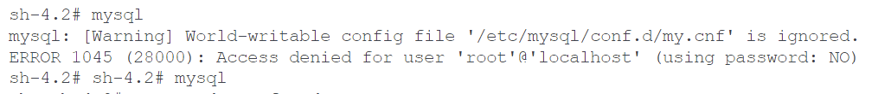
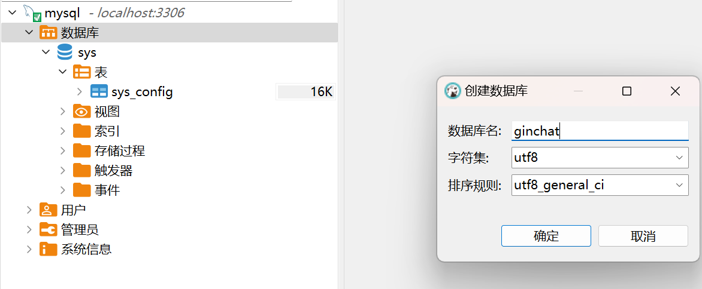

# docker安装mysql
```
# mysql连接器
choco install dbeaver
docker pull mysql:5.7
# 创建映射文件夹
# D:\program files\mysql5.7\conf
# D:\program files\mysql5.7\data
# D:\program files\mysql5.7\logs
# D:\program files\mysql5.7\my.cnf

my.cnf

# mysql_native_password 5.7的加密方式， 8为caching_sha2_password
# expire_logs_days 日志保留时间
```

```
// sql_mode中添加NO_ZERO_IN_DATE,NO_ZERO_DATE,会让数据库拒绝写入（月日都不为0，年月日都为0）
// sql_mode=STRICT_TRANS_TABLES,NO_ZERO_IN_DATE,NO_ZERO_DATE,ERROR_FOR_DIVISION_BY_ZERO,

// set @@session.sql_mode="STRICT_TRANS_TABLES,STRICT_ALL_TABLES,NO_ZERO_IN_DATE,NO_ZERO_DATE,ERROR_FOR_DIVISION_BY_ZERO,NO_ENGINE_SUBSTITUTION";
// 上面的只改当前，全局是不改的，退出mysql重进,global依然不变，session恢复成global
// select @@session.sql_mode;
// set @@global.sql_mode="STRICT_TRANS_TABLES,STRICT_ALL_TABLES,NO_ZERO_IN_DATE,NO_ZERO_DATE,ERROR_FOR_DIVISION_BY_ZERO,NO_ENGINE_SUBSTITUTION";
// select @@global.sql_mode;
// 上面的是退出mysql重新进mysql才会生效, 并且会把@@session.sql_mode改为和它一样，但是如果没退session当前的还是没改之前的。

// 设置全局和当前，在重启系统后都会失效的，建议也在my.cnf中改，然后重启系统，依据配置生效

// mysql --help | grep my.cnf

// 右边会覆盖左边的

[mysqld]
user=mysql
character-set-server=utf8
default_authentication_plugin=mysql_native_password
secure_file_priv=/var/lib/mysql
expire_logs_days=7
sql_mode=STRICT_TRANS_TABLES,STRICT_ALL_TABLES,NO_ZERO_IN_DATE,NO_ZERO_DATE,ERROR_FOR_DIVISION_BY_ZERO,NO_ENGINE_SUBSTITUTION
max_connections=1000
 
[client]
default-character-set=utf8
 
[mysql]
default-character-set=utf8
```

```
# windows上
docker run -d --restart=always --privileged=true `
-v D:\"program files"\mysql5.7\data:/var/lib/mysql `
-v D:\"program files"\mysql5.7\logs:/var/log/mysql `
-v D:\"program files"\mysql5.7\conf:/etc/mysql/conf.d `
-v D:\"program files"\mysql5.7\conf\my.cnf:/etc/mysql/conf.d/my.cnf `
-p 3306:3306 --name mysql-service `
-e MYSQL_ROOT_PASSWORD=123456 `
mysql:5.7

# --restart=always 当Docker 重启时，容器会自动启动
# --privileged=true：容器内的root拥有真正root权限，否则容器内root只是外部普通用户权限
```


```
sh-4.2# mysql
mysql: [Warning] World-writable config file '/etc/mysql/conf.d/my.cnf' is ignored.
ERROR 1045 (28000): Access denied for user 'root'@'localhost' (using password: NO)
```

```
# my.cnf权限太高，需要去改权限
# 权限全局可写，任何一个用户都可以写。mysql担心这种文件被其他用户恶意修改，所以忽略掉这个配置文件。导致无法进入，这也是mysql的安全机制之一。所以我们必须得改一些权限。设置其他用户不可写。

docker exec -it mysql-service /bin/bash
bash-4.2# chmod 644 /etc/mysql/conf.d/my.cnf
bash-4.2# exit

docker restart mysql-service
```

## 创建database

## 登录mysql
```
# 进入mysql终端
sh-4.2# mysql -uroot -p
Enter password: 
Welcome to the MySQL monitor.  Commands end with ; or \g.
Your MySQL connection id is 2
Server version: 5.7.40 MySQL Community Server (GPL)

Copyright (c) 2000, 2022, Oracle and/or its affiliates.

Oracle is a registered trademark of Oracle Corporation and/or its
affiliates. Other names may be trademarks of their respective
owners.

Type 'help;' or '\h' for help. Type '\c' to clear the current input statement.

mysql> 

```

```
use mysql;
```

use mysql or another database

## 设置远程访问
```
update use set Host='%' where User = 'root';
// 刷新
flush privileges;
```

## 常用命令
show database;
create database user;

## 常见错误
### MYSQL新特性secure_file_priv 读写文件
```
ERROR: mysqld failed while attempting to check config
command was: "mysqld --verbose --help"

mysqld: Error on realpath() on '/var/lib/mysql-files' (Error 2 - No such file or directory)
[ERROR] [MY-010095] [Server] Failed to access directory for --secure-file-priv. Please make sure that directory exists and is accessible by MySQL Server. Supplied value : /var/lib/mysql-files
[ERROR] [MY-010119] [Server] Aborting

解决问题:
windows下：修改my.ini 在[mysqld]内加入secure_file_priv=/var/lib/mysql
linux下：修改my.cnf 在[mysqld]内加入secure_file_priv=/var/lib/mysql
```